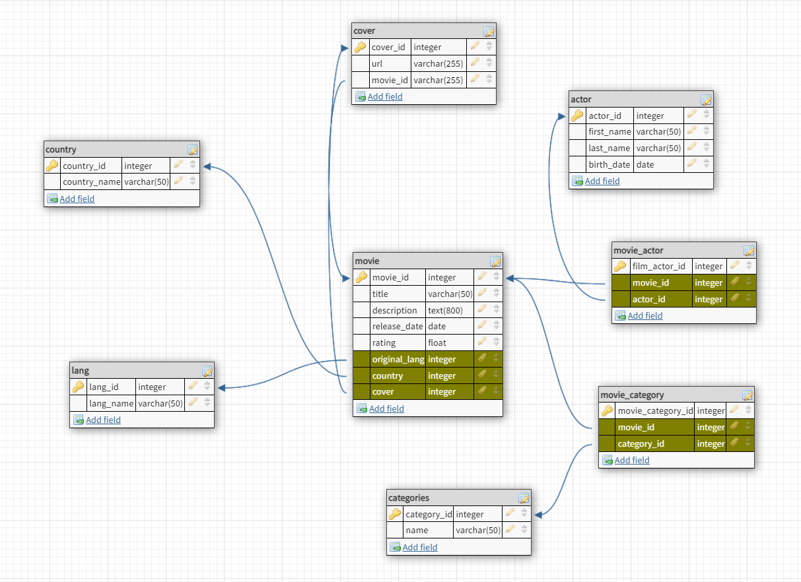

💊 MySQL Basics MIQUEL ABELLA

_MySQL, SQL language, setting environment variables._

### 📂 Content

This repository contains only the following:

- **_README.md_**: this explanatory file.
- **_employees.sql_**: file containing an example database provided by the official MySQL team, to import and use in our exercise.
- **_queries.sql_**: file where we recorded all the necessary queries executed to fulfill this exercise.
- **_assets_folder_**: Images of the databases schemas.

### Requirements
- XAMPP OR LAMPP INSTALLED - https://www.apachefriends.org/es/download.html

### How to use
- Paste the content of the .msql files into the terminal in order to create, update and get information of the database.
- You can import files to a database manager application if prefered.

### DB SCHEMAS

